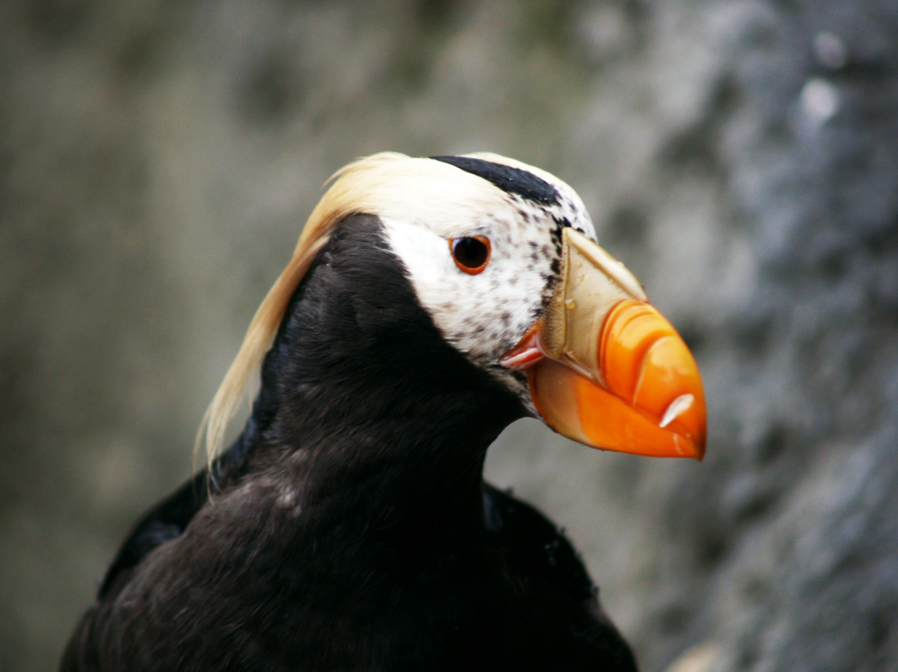

## Alt text does not work with urls

```
{fig.alt="alt text: it is a very cute puffin."}
```

{fig.alt="alt text: it is a very cute puffin."}

---

## Alt text does not work with local images either

```
{fig.alt="alt text: it is a very cute puffin."}
```

{fig.alt="alt text: it is a very cute puffin."}


