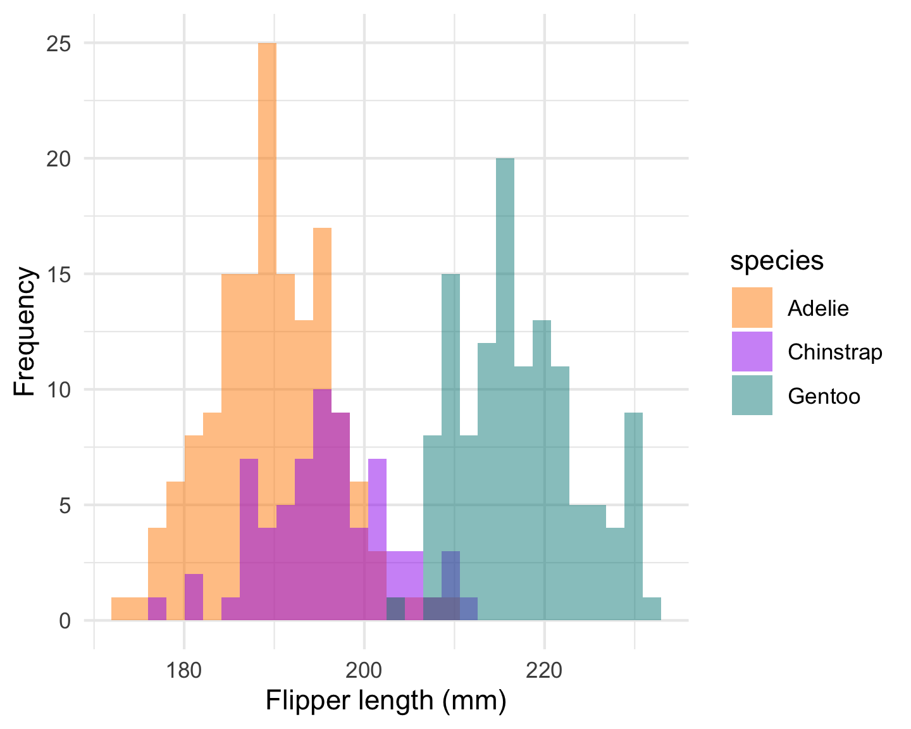

```{r setup, include=FALSE}
library(tidyverse)
library(palmerpenguins)
library(ymlthis)
knitr::opts_chunk$set(fig.path="figs/")
```

------------------------------------------------------------------------

```{r}
head(penguins, 4)
```

------------------------------------------------------------------------

## Stacked histogram (wrong)

```{r stack-hist, warning=FALSE, message=FALSE}
# Histogram example: flipper length by species
ggplot(data = penguins, 
       aes(x = flipper_length_mm)) +
  geom_histogram(
    aes(fill = species), 
    alpha = 0.5) +
  scale_fill_manual(values = c("darkorange","darkorchid","cyan4"))
```

------------------------------------------------------------------------

## Dodged histogram (better)

```{r dodge-hist, echo=FALSE, warning=FALSE, message=FALSE}
# Histogram example: flipper length by species
ggplot(data = penguins, 
       aes(x = flipper_length_mm)) +
  geom_histogram(
    aes(fill = species), 
    alpha = 0.5, 
    position = "identity") + #<<
  scale_fill_manual(values = c("darkorange","darkorchid","cyan4"))
```

------------------------------------------------------------------------

# Do you teach literate programming?

```{r flipper-hist, include=FALSE}
flipper_hist <- ggplot(data = penguins, aes(x = flipper_length_mm)) +
  geom_histogram(aes(fill = species),
                 alpha = 0.5,
                 position = "identity") +
  scale_fill_manual(values = c("darkorange","purple","cyan4")) +
  theme_minimal() +
  labs(x = "Flipper length (mm)",
       y = "Frequency")
flipper_hist
```

---

## Testing

```{r echo=FALSE}
ggplot(data = penguins, aes(x = bill_length_mm, y = bill_depth_mm)) +
  geom_point(aes(color = species,
                 shape = species),
             size = 2)  +
  scale_color_manual(values = c("darkorange","darkorchid","cyan4"))
```

---

## Surprised that warnings/messages push plots to next slide?

```{r echo=FALSE, message=FALSE, warning=FALSE, fig.asp=.5}
ggplot(data = penguins, aes(x = bill_length_mm, y = bill_depth_mm)) +
  geom_point(aes(color = species,
                 shape = species),
             size = 2)  +
  scale_color_manual(values = c("darkorange","darkorchid","cyan4"))
```

------------------------------------------------------------------------

## Penguin party!

```{r echo=FALSE}
knitr::include_graphics("images/penguins_cran.png")
```

------------------------------------------------------------------------

## Teaching in Production

. . .

Tip \#1: Use R Markdown to make slides with [xaringan](https://github.com/yihui/xaringan)

. . .

Tip \#2: Use R Markdown to make a shareable site with [distill](https://rstudio.github.io/distill/)

. . .

Q & A

------------------------------------------------------------------------

I don't get it

<https://pandoc.org/MANUAL.html#inserting-pauses>

Oh: "Note: this feature is not yet implemented for PowerPoint output."

so no incremental slides

------------------------------------------------------------------------

## The output format

```{r echo=FALSE}
yml_empty() %>%
  yml_output(xaringan::moon_reader()) %>% 
  asis_yaml_output()
```

------------------------------------------------------------------------

## Using markdown

Fair game:

-   headers (`#`, etc.)

-   **bold**

-   *italics*

-   lists (like this one!)

------------------------------------------------------------------------

PowerPoint

    Templates included with Microsoft PowerPoint 2013 (either with .pptx or .potx extension) are known to work, as are most templates derived from these.

    The specific requirement is that the template should begin with the following first four layouts:

        Title Slide
        Title and Content
        Section Header
        Two Content

    All templates included with a recent version of MS PowerPoint will fit these criteria. (You can click on Layout under the Home menu to check.)

    You can also modify the default reference.pptx: first run pandoc -o custom-reference.pptx --print-default-data-file reference.pptx, and then modify custom-reference.pptx in MS PowerPoint (pandoc will use the first four layout slides, as mentioned above).

------------------------------------------------------------------------

## Observations

1.  Code looks like crap, and I cannot do anything about it?

1.  The reference template looks like crap?

1.  My plots look like crap? Why is the resolution so poor?


------------------------------------------------------------------------

## Speaker notes?

wow that works- very neat `r emo::ji("tada")`

ooh and emojis work too `r emo::ji("trophy")`

::: notes

you shouldn't be reading this right now

:::

------------------------------------------------------------------------

## Columns

This syntax is insane

::: {.columns}
::: {.column width="40%"}
left
:::

::: {.column width="60%"}
right
somehow, these columns end up on a different slide?
oh right, because I tried to use words above, see: "This syntax is insane"
:::
:::


----------------------------------------------------------------------

## So two column won't work, huh?

Cool cool.

I just copy pasted from here: <https://pandoc.org/MANUAL.html#columns>

Note: this ended up working (I think) after going into visual editor mode then back. 

------------------------------------------------------------------------

## from a blog post

<https://stymied.medium.com/what-slides-from-markdown-5239ed31e7ac>

::: {.columns}
::: {.column width="50%"}
Left column:

-   Bullet
-   Bullet
-   Bullet
:::

::: {.column width="50%"}

:::
:::

------------------------------------------------------------------------

## why???


::: {.columns}
::: {.column width="50%"}
Left column:

-   Bullet
-   Bullet
-   Bullet
:::

::: {.column width="50%"}

```{r fig.cap="Yes caption!", echo=FALSE}
flipper_hist
```

:::
:::

------------------------------------------------------------------------

## Reading in the figure manually


::: {.columns}
::: {.column width="10%"}
Left column at `width='10%'`?:

-   This
-   is
-   a
-   hack
:::

::: {.column width="90%"}



:::
:::

------------------------------------------------------------------------

## OK how about a style template?

Womp womp.

    output file: slides.knit.md

    Could not find shape for Powerpoint content
    Error: pandoc document conversion failed with error 63
    In addition: Warning messages:
    1: Removed 2 rows containing non-finite values (stat_bin). 
    2: Removed 2 rows containing non-finite values (stat_bin). 
    Execution halted

------------------------------------------------------------------------

<https://ljupcho.com/blog/powerpoint>

> The template slides need to be made as slide masters, not actual slides.

------------------------------------------------------------------------

### PRO-TIP:

### Power up R Markdown and knitr (this should be on same slide as PRO-TIP)

------------------------------------------------------------------------

## Side-by-side code + plot

Why? Don't repeat yourself!

1.  Code first, plot second

    -   Chunk 1: `{r plot-last, fig.show = 'hide'}`
    -   Chunk 2: `{r ref.label = 'plot-last', echo = FALSE}`

2.  Plot first, code second

    -   Chunk 1: `{r plot-first, echo = FALSE}`
    -   Chunk 2: `{r ref.label = 'plot-first', fig.show = 'hide'}`

------------------------------------------------------------------------

## More observations

-   The default 4:3 looks super-dated, and hard to know that you must change the reference template

- turning on visual editor made all my `---` slide separators turn into full lines? That is not pleasant. Three is "just enough" visually for an HR?

- BUT it changed all my insane div syntax to `:::`- much better!

- It took me awhile to figure out how slide separators and heading levels started new slides

---

## Slide templates

Making the reference slide template well is kind of a game changer- sharing some good templates might be very welcome.

Setting them up the right way is a huge gotcha.

Most powerpoint users are given a template- only advanced PPT users make their own slide templates, or have others make a **real** template for them. 

We'll need to teach "PPT for R Markdown users" 


---


Also, there are lots of slide layouts in there, but I have no idea how to use them?

Pandoc says:

The specific requirement is that the template should begin with the following first four layouts:

+ Title Slide
+ Title and Content
+ Section Header
+ Two Content

From Pandoc:

> You can also modify the default reference.pptx: first run pandoc -o custom-reference.pptx --print-default-data-file reference.pptx, and then modify custom-reference.pptx in MS PowerPoint (pandoc will use the first four layout slides, as mentioned above).


---

## Pain points

+ no model reference slide template provided, and no easy way to make one that fits pandoc's weird needs (can we wrap the pandoc function?)
+ no R output in two column slides- huge bummer.
+ no ANYTHING else on two columns slides- just the slide title and the columns.
+ in two column slides, `width` appears to do nothing?

---

## Pain points (continued)

+ no way to control code overflow. With HTML you can work with CSS, but it feels impossible this way other than manually in PPT?
+ `monofont` in YAML is namechecked by pandoc, but doesn't work? https://rmarkdown.rstudio.com/docs/reference/powerpoint_presentation.html
+ my template has a footer with date, slide number, etc.- where is that?
+ no background images, or even inverse slides

---

## Seeing my layout options

This is handy, `officer::layout_summary()`

```{r echo=FALSE}
library(officer)
my_template <- read_pptx("alison-template.pptx") 
layout_summary(my_template) 
```

---

## Try kable instead

```{r echo=FALSE}
layout_summary(my_template) %>% 
  knitr::kable()
```

