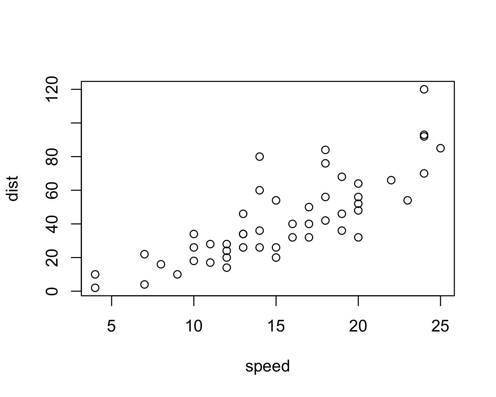
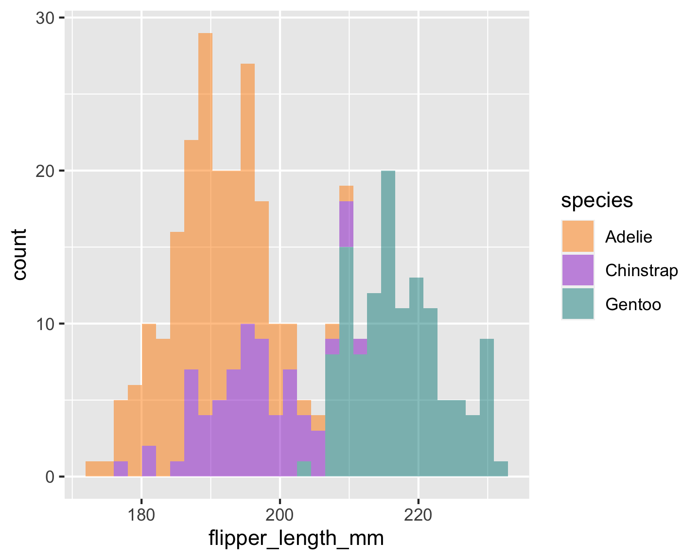
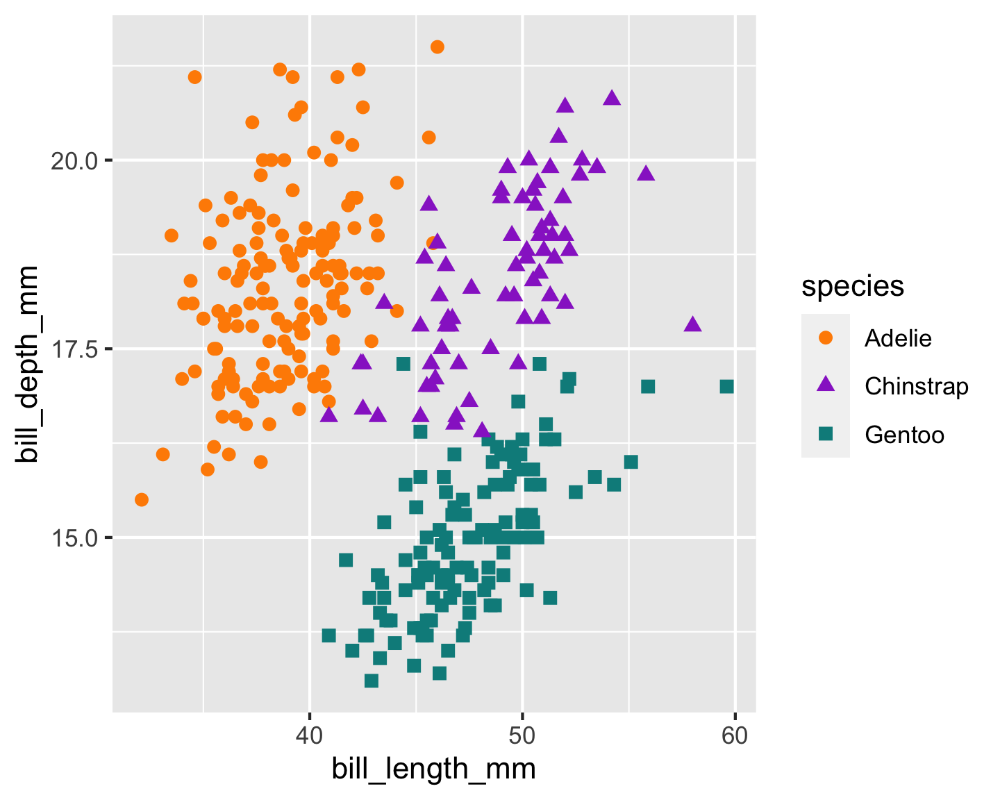
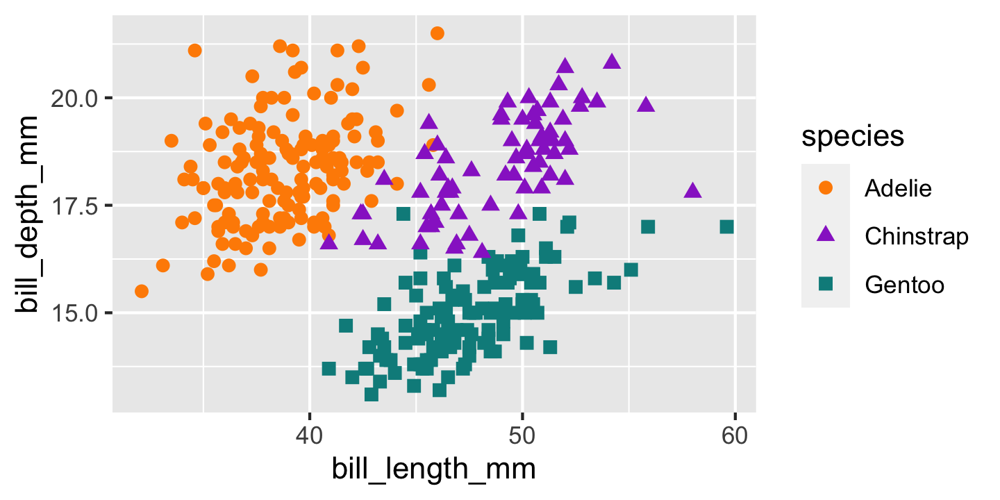
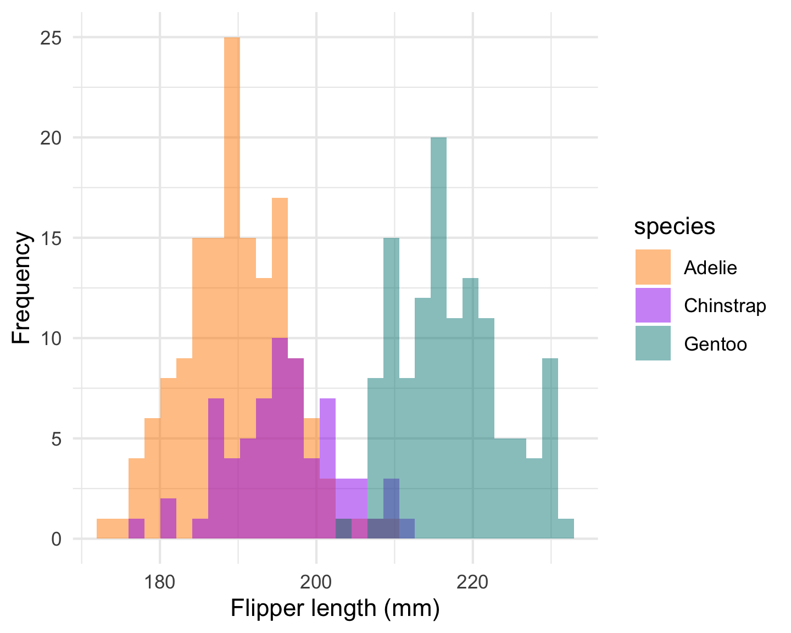
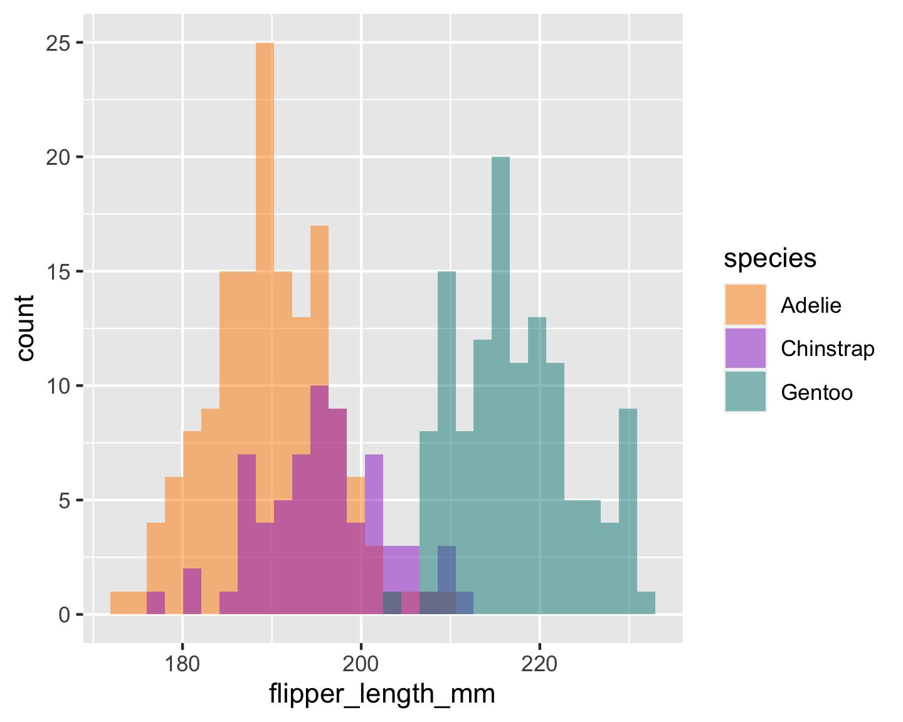

hello

---

# hi

---


Just some normal text on this slide please

---

if slide level is 1, I cannot use section slides

---

# one

## two

---

### three

#### four

---

# am I header

---

# test

l1 above me, but I'm on a new slide

---

# test

## l1 above me, but I'm on a new slide

---

## test

---

l2 above me

---

## l2

### l3

---

## Alt text does not work with urls

---

```
{fig.alt="alt text: it is a very cute puffin."}
```

{fig.alt="alt text: it is a very cute puffin."}

---

## Alt text does not work with local images either

```
{fig.alt="alt text: it is a very cute puffin."}
```

{fig.alt="alt text: it is a very cute puffin."}

---

## Resizing images with `out.width` does not work


```r
plot(cars)
```

{width=1%}

https://github.com/jgm/pandoc/issues/4586

------------------------------------------------------------------------

# Where does the code go?


```r
head(penguins, 4)
```

```
## # A tibble: 4 x 8
##   species island bill_length_mm bill_depth_mm flipper_length_… body_mass_g sex  
##   <fct>   <fct>           <dbl>         <dbl>            <int>       <int> <fct>
## 1 Adelie  Torge…           39.1          18.7              181        3750 male 
## 2 Adelie  Torge…           39.5          17.4              186        3800 fema…
## 3 Adelie  Torge…           40.3          18                195        3250 fema…
## 4 Adelie  Torge…           NA            NA                 NA          NA <NA> 
## # … with 1 more variable: year <int>
```

------------------------------------------------------------------------

## Where does the h2 go?


```r
head(penguins, 4)
```

```
## # A tibble: 4 x 8
##   species island bill_length_mm bill_depth_mm flipper_length_… body_mass_g sex  
##   <fct>   <fct>           <dbl>         <dbl>            <int>       <int> <fct>
## 1 Adelie  Torge…           39.1          18.7              181        3750 male 
## 2 Adelie  Torge…           39.5          17.4              186        3800 fema…
## 3 Adelie  Torge…           40.3          18                195        3250 fema…
## 4 Adelie  Torge…           NA            NA                 NA          NA <NA> 
## # … with 1 more variable: year <int>
```


------------------------------------------------------------------------

# Where does the teeny tiny plot go?


```r
plot(cars)
```

{width=1%}

------------------------------------------------------------------------

# But this works 

- Adelie
- Chinstrap 4
- Gentoo


```r
2 + 2
```

```
## [1] 4
```


------------------------------------------------------------------------

## I'm unlisted {.unlisted .unnumbered}

# Hello- I'd like to not be on a new slide

<https://github.com/rstudio/rmarkdown/issues/1625>


------------------------------------------------------------------------

## Code forces plot on new slide ...


```r
# Histogram example: flipper length by species
ggplot(data = penguins, 
       aes(x = flipper_length_mm)) +
  geom_histogram(
    aes(fill = species), 
    alpha = 0.5) +
  scale_fill_manual(values = c("darkorange","darkorchid","cyan4"))
```

{width=480}


------------------------------------------------------------------------

# this works

{width=480}

------------------------------------------------------------------------

# Do you teach literate programming?


------------------------------------------------------------------------

## Testing


```
## Warning: Removed 2 rows containing missing values (geom_point).
```

{width=480}

------------------------------------------------------------------------

## Surprised that warnings/messages push plots to next slide?

{width=480}

------------------------------------------------------------------------

## Penguin party!

<!-- -->

------------------------------------------------------------------------

## Teaching in Production

. . .

Tip \#1: Use R Markdown to make slides with [xaringan](https://github.com/yihui/xaringan)

. . .

Tip \#2: Use R Markdown to make a shareable site with [distill](https://rstudio.github.io/distill/)

. . .

Q & A

------------------------------------------------------------------------

I don't get it

<https://pandoc.org/MANUAL.html#inserting-pauses>

Oh: "Note: this feature is not yet implemented for PowerPoint output."

so no incremental slides

------------------------------------------------------------------------

## The output format

```yaml
---
output: xaringan::moon_reader
---
```

------------------------------------------------------------------------

## Using markdown

Fair game:

-   headers (`#`, etc.)

-   **bold**

-   *italics*

-   lists (like this one!)

You can include **Knit** markdown as *normal*[^1].[^2]

[^1]: A footnote

[^2]: does this work?

------------------------------------------------------------------------

PowerPoint

    Templates included with Microsoft PowerPoint 2013 (either with .pptx or .potx extension) are known to work, as are most templates derived from these.

    The specific requirement is that the template should begin with the following first four layouts:

        Title Slide
        Title and Content
        Section Header
        Two Content

    All templates included with a recent version of MS PowerPoint will fit these criteria. (You can click on Layout under the Home menu to check.)

    You can also modify the default reference.pptx: first run pandoc -o custom-reference.pptx --print-default-data-file reference.pptx, and then modify custom-reference.pptx in MS PowerPoint (pandoc will use the first four layout slides, as mentioned above).

------------------------------------------------------------------------

## Observations

1.  Code looks like crap, and I cannot do anything about it?

2.  The reference template looks like crap?

3.  My plots look like crap? Why is the resolution so poor?

------------------------------------------------------------------------

## Speaker notes?

wow that works- very neat 🎉

ooh and emojis work too 🏆

::: {.notes}
you shouldn't be reading this right now
:::

------------------------------------------------------------------------

## Columns

This syntax is insane

::: {.columns}
::: {.column width="40%"}
left
:::

::: {.column width="60%"}
right somehow, these columns end up on a different slide? oh right, because I tried to use words above, see: "This syntax is insane"
:::
:::

------------------------------------------------------------------------

## So two column won't work, huh?

Cool cool.

I just copy pasted from here: <https://pandoc.org/MANUAL.html#columns>

Note: this ended up working (I think) after going into visual editor mode then back.

------------------------------------------------------------------------

## from a blog post

<https://stymied.medium.com/what-slides-from-markdown-5239ed31e7ac>

::: {.columns}
::: {.column width="50%"}
Left column:

-   Bullet
-   Bullet
-   Bullet
:::

::: {.column width="50%"}

:::
:::

------------------------------------------------------------------------

## why???

::: {.columns}
::: {.column width="50%"}
Left column:

-   Bullet
-   Bullet
-   Bullet
:::

::: {.column width="50%"}
{width=480}
:::
:::

------------------------------------------------------------------------

## Reading in the figure manually

::: {.columns}
::: {.column width="10%"}
Left column at `width='10%'`?:

-   This
-   is
-   a
-   hack
:::

::: {.column width="90%"}

:::
:::

------------------------------------------------------------------------

## Testing officedown


```
## $code
## <quosure>
## expr: ^
## env:  empty
## 
## $ggobj
```

{width=480}

```
## 
## $bg
## [1] "white"
## 
## $fonts
## list()
## 
## $pointsize
## [1] 12
## 
## $editable
## [1] TRUE
## 
## attr(,"class")
## [1] "dml"
```

{width=480}

## ggplot in right column

-   Some
-   Bullets


```
## $code
## <quosure>
## expr: ^
## env:  empty
## 
## $ggobj
```

{width=480}

```
## 
## $bg
## [1] "white"
## 
## $fonts
## list()
## 
## $pointsize
## [1] 12
## 
## $editable
## [1] TRUE
## 
## attr(,"class")
## [1] "dml"
```

------------------------------------------------------------------------

## OK how about a style template?

Womp womp.

    output file: slides.knit.md

    Could not find shape for Powerpoint content
    Error: pandoc document conversion failed with error 63
    In addition: Warning messages:
    1: Removed 2 rows containing non-finite values (stat_bin). 
    2: Removed 2 rows containing non-finite values (stat_bin). 
    Execution halted

------------------------------------------------------------------------

<https://ljupcho.com/blog/powerpoint>

> The template slides need to be made as slide masters, not actual slides.

------------------------------------------------------------------------

### PRO-TIP:

### Power up R Markdown and knitr (this should be on same slide as PRO-TIP)

------------------------------------------------------------------------

## Side-by-side code + plot

Why? Don't repeat yourself!

1.  Code first, plot second

    -   Chunk 1: `{r plot-last, fig.show = 'hide'}`
    -   Chunk 2: `{r ref.label = 'plot-last', echo = FALSE}`

2.  Plot first, code second

    -   Chunk 1: `{r plot-first, echo = FALSE}`
    -   Chunk 2: `{r ref.label = 'plot-first', fig.show = 'hide'}`

